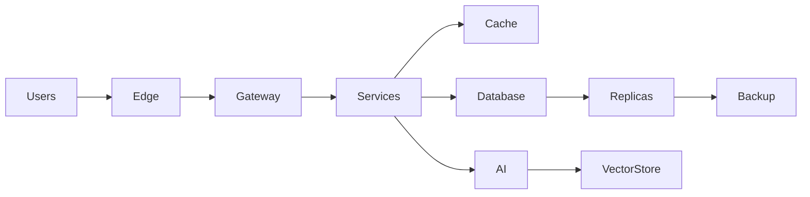

<p align="center">
  
</p>

<p align="center">
  
</p>

---

# Hüseyin Gülen

Software Architect building scalable, secure and production-grade systems.

I design infrastructure.  
I build resilient platforms.  
I solve complexity.

---

## System Design Approach



**Principles**

```
Architecture > Code
Scalability > Speed
Security > Convenience
Reliability > Trend
```

Great systems are quiet.  
If you notice the infrastructure — it is already failing.

---

## Now

Designing AI-native platforms, secure infrastructures and distributed systems.

---

## Selected Work

**AI Skin Analysis Platform**  
Commercial computer vision system.

**Enterprise ERP**  
Operational backbone for multi-branch businesses.

**Secure Linux Environments**  
Hardened production architectures.

---

## Stack

Laravel • Node.js • Python  
Linux • Docker • Redis  
React • Next.js  
Cloud • AI Systems  

---

## Contact

huseyingulen.net  
hello@huseyingulen.net

---

<p align="center">
Built for scale.
</p>
