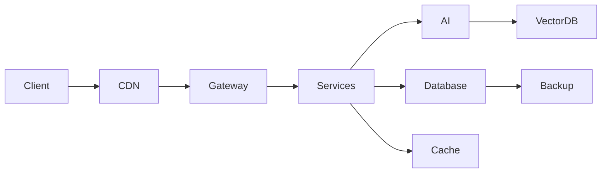

<!-- ULTRA BLACK BANNER -->

<p align="center">
  
</p>

<p align="center">
  
</p>

<p align="center">
  
</p
---

# Hüseyin Gülen

**Software Architect • AI Systems Builder • Cyber Security Engineer**

Production seviyesinde çalışan, ölçeklenebilir ve güvenli dijital sistemler tasarlıyorum.

Kod yazmaktan çok **mimari kurarım.**

---

## Architect Mindset

```
Architecture > Code
Security > Convenience
Scalability > Speed
Signal > Noise
```

Büyük sistemler sessiz çalışır.

---

## Şu Anda Odaklandığım Alanlar

- AI tabanlı ticari platformlar  
- Self-hosted cloud ekosistemleri  
- Secure infrastructure design  
- Mikroservis mimarileri  
- LLM destekli otomasyonlar  
- High-availability sistemler  

---

## Sistem Tasarım Yaklaşımım



**Prensip:** Tek noktadan hata vermeyen, yatay ölçeklenebilir sistemler.

---

## Selected Systems

**AI Skin Analysis Platform**  
Computer vision destekli ticari analiz sistemi.

Stack: `Python` `AI` `Cloud` `Vision Models`

---

**Enterprise ERP**  
Finans, operasyon ve randevu orkestrasyonu yapan işletme platformu.

Stack: `Laravel` `Docker` `Microservices`

---

**Secure Production Environments**  
Hardened Linux altyapıları ve güvenli CI/CD pipeline’ları.

Odak: **Stability + Security**

---

## GitHub Activity

<p align="center">
  
  
</p>

---

## Uses

### Editor
- VS Code / Cursor  
- JetBrains tools  

### Backend
- Laravel  
- Node.js  
- Python  

### Frontend
- React  
- Next.js  

### Infrastructure
- Linux  
- Docker  
- Nginx  
- Redis  

### AI
- OpenAI  
- Local LLMs  
- Vector Databases  

---

## AI-First Engineering

Yapay zekayı sadece entegre etmem.  
Ürünlerin merkezine konumlandırırım.

Odak noktalarım:

- AI-native product design  
- Prompt architecture  
- Retrieval sistemleri  
- Automation agents  
- Computer vision  

---

## Contribution Graph

<p align="center">
  
</p>

> Snake için GitHub Action gerekir. İstersen tek dosyada kurulum atabilirim.

---

## Manifesto

```
Basit tasarla.
Güvenli kur.
Yatay ölçekle.
Sessiz çalıştır.
```

İyi yazılım görünmezdir.  
Harika altyapı fark edilmez.

---

## Contact

Website → https://huseyingulen.net  
Mail → hello@huseyingulen.net  

---

<p align="center">
<strong>Designing systems that survive scale.</strong>
</p>

<p align="center">
  
</p>
