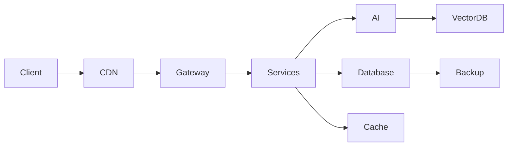

<!-- ANIMATED HEADER -->
<p align="center">
  
</p>

<p align="center">
  
</p>

---
Yüksek performanslı, güvenli ve ölçeklenebilir sistemlerin mimarıyım. Web, Cloud ve Yapay Zeka teknolojilerini teoriden çıkarıp, production seviyesinde yüksek trafikli platformlara dönüştürüyorum.

> Sadece kod yazmam. Sistem inşa ederim.

---

## Sistem Tasarım Yaklaşımım


---

## 🧠 Uzmanlık Alanlarım

**Mühendislik**
- Sistem mimarisi  
- Mikroservis altyapılar  
- High-performance backend  
- API ekosistemleri  
- Enterprise Laravel  

**Güvenlik**
- Pentest  
- Secure architecture  
- Zero-trust yaklaşımları  
- Encryption & veri koruma  

**Altyapı**
- Linux engineering  
- Docker / container mimarileri  
- CI/CD  
- Observability  
- Performans optimizasyonu  

**Yapay Zeka**
- AI ürün entegrasyonu  
- Prompt engineering  
- Computer vision  
- Akıllı otomasyon sistemleri  

---

### Secure Production Infrastructures
Kritik sistemler için hardened Linux ortamları ve güvenli deployment pipeline'ları.

**Odak:** Stabilite + Güvenlik  

---

## 📊 GitHub Aktivite

<div align="center">
  
</div>

---

## 🧰 Teknoloji Yığını

### Backend


### Frontend


### Infrastructure


---

## 🧭 Teknik Manifesto

```
Mimari > Kod
Güvenlik > Hızlı Çözümler
Performans > Trendler
Ölçeklenebilirlik > Kısa Yollar
Basitlik > Karmaşıklık
```

**İyi yazılım görünmezdir.  
Büyük sistemler sessiz çalışır.**

---

## 🌐 İletişim

Website: https://huseyingulen.net  
Mail: hello@huseyingulen.net  

---

<p align="center">
<strong>Building systems that survive scale.</strong>
</p>
